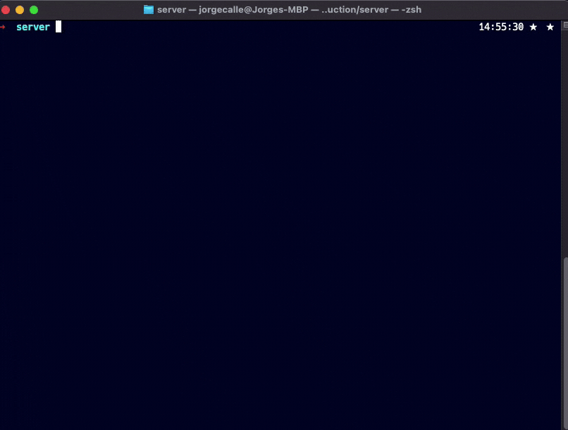
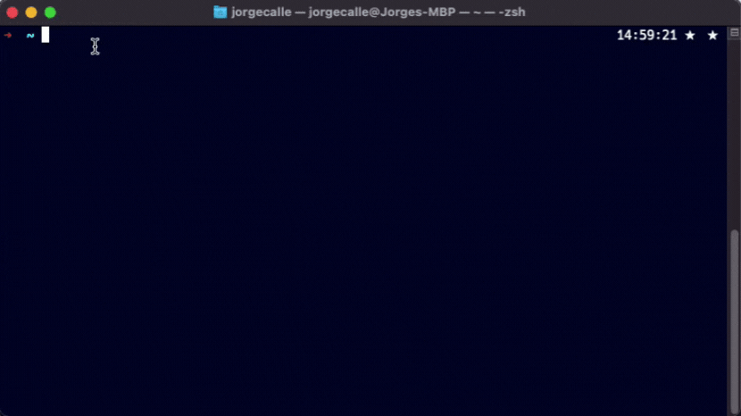

# GameClient ⭐️
## ✨ Demo

# 💻 Built With

* [JavaFX](https://openjfx.io) - GUI Framework
* [Scene Builder](https://gluonhq.com/products/scene-builder/) - Design JavaFX application
* [Apache Derby](https://db.apache.org/derby/) - Relational Database
* [JUnit5](https://junit.org/junit5/docs/current/user-guide/) - Testing Framework
* [Spring boot](https://spring.io/projects/spring-boot) - Microservice
  * [Java Server](https://github.com/jlcalleu18/GameServer) - Server

JavaFX UI controls
## ✨ Demo 
* Running [Java microserver](https://github.com/jlcalleu18/GameServer)
 
 
* Start Derby Network Server
 
 
* Database in Derby
 

